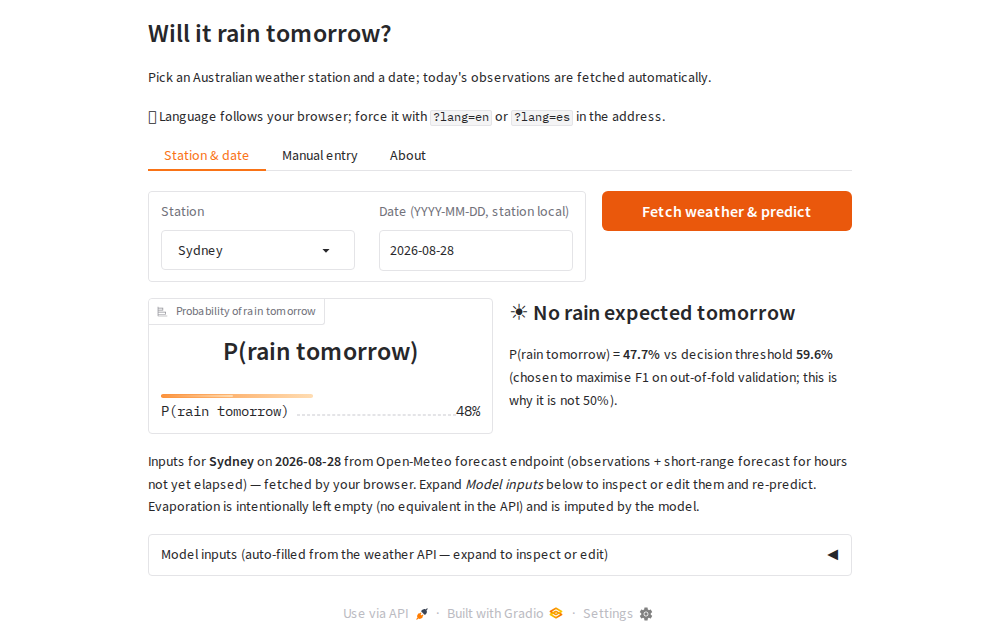

# australia-rain-app

**Will it rain tomorrow at an Australian weather station?**
Live app: **https://australia-rain-app.onrender.com** · Spanish: [`?lang=es`](https://australia-rain-app.onrender.com/?lang=es)



A web application serving the rain classifier developed in the academic project
[australia-rain-prediction](https://github.com/ZahirJacob/australia-rain-prediction)
(Dimenna, Jacob, Taborda). Pick one of 49 stations, keep today's date, press the
button: the day's weather is fetched from a free API and the model answers with a
probability and a yes/no verdict. No TensorFlow, no API key, free hosting.

**Author:** Zahir Jacob. This application is personal follow-up work and is not
part of the academic project; the model and its evaluation are theirs (see
[Provenance](#provenance-and-parity-with-the-original-model)).

## Using the app

| Tab | What it does |
|---|---|
| **Station & date** | Choose a station (the date defaults to *today* at that station) and press *Fetch weather & predict*. The 20 model inputs are fetched by **your browser** from Open-Meteo and shown, editable, in a collapsed panel — change a value and re-predict to see what the model reacts to. |
| **Manual entry** | Enter observations yourself (BoM conventions); blanks are imputed by the model. |
| **About** | What the model is, how accurate it is, and its honest caveats. |

* **Language** follows the browser (English default, Spanish supported);
  `?lang=en` / `?lang=es` in the address forces it.
* **The verdict uses the model's decision threshold (59.6 %)**, chosen to
  maximise F1 on out-of-fold data — a 55 % probability is therefore "no rain".
* **Free-tier hosting:** after 15 idle minutes the first visitor waits about a
  minute for the server to wake.

## How it works

```
browser ──fetch──▶ Open-Meteo (hourly, UTC) ──JSON──▶ server: BoM-style daily record
                                                       → frozen preprocessor (sklearn)
                                                       → 4-layer MLP in numpy
                                                       → P(rain) vs threshold 0.596
```

* **Model without TensorFlow** (`rainapp/model.py`). The frozen Keras network
  (`nn_config_5`, 3,909 parameters) is evaluated with numpy from its 8 weight
  tensors. The preprocessing pipeline is the original one, byte for byte.
* **Weather from Open-Meteo, fetched by the visitor's browser**
  (`app.py`, `rainapp/weather_source.py`). Open-Meteo's free tier is rate-limited
  per IP address and the hosting provider's outbound IP is shared, so the page's
  JavaScript performs the request from the visitor's own connection and hands the
  JSON to the server, which validates it (station coordinates, date coverage)
  and falls back to a server-side request if needed.
* **BoM time windows** (`rainapp/weather_source.py`). `Rainfall`, `MinTemp` and
  `Evaporation` are the 24 h ending 09:00 local; `MaxTemp`, `Sunshine` and gusts
  the local calendar day; the 9 am / 3 pm values are those local hours. All of it
  is aggregated from hourly data in true local time (`zoneinfo` per station),
  because the training data follows these conventions and `RainTomorrow(D)`
  equals `RainToday(D+1)`: the label window starts at 09:00 today.
* **One page-load hook** picks the language and relabels every text
  (`rainapp/i18n.py`), so the server is the single source of truth for both
  languages.

## How accurate is it

| Evaluation | F1 (rain) | Precision | Recall | ROC-AUC |
|---|---|---|---|---|
| Final held-out test, BoM observations (28,431 days) | 0.653 | 0.640 | 0.667 | 0.885 |
| Expanding-window temporal check (train on the past, predict the future) | 0.640 | 0.612 | 0.670 | 0.871 |
| Inputs from Open-Meteo instead of BoM instruments (12 stations × 2016) | 0.624 | 0.599 | 0.651 | — |

The first two rows are the academic project's numbers. The third is measured
here (`scripts/evaluate_api_shift.py`): feeding the model from the free API
costs about 0.04 F1, almost entirely as extra rain warnings. Rainfall (corr 0.59
with the gauge) and wind directions (~30 % exact 16-point match) transfer worst;
pressure (0.996) and temperatures (0.97–0.98) transfer almost perfectly. Pan
`Evaporation` has no API equivalent and is left missing (imputed); using FAO ET0
instead gains +0.004 F1, within noise. 2016 overlaps the academic
development/test split, so only the gap between input sources is meaningful.
Details: `artifacts/api_shift_2016_*.json`.

This is not a better forecast than the weather service — Open-Meteo itself
provides one. It is a demonstration of a trained classifier on real inputs.

## Provenance and parity with the original model

The classifier and its preprocessing pipeline were developed, selected and
evaluated in the academic project *AA1 – TUIA* by Dimenna, Jacob and Taborda;
that project is the authority on methodology and metrics. Nothing was retrained.

| Component | Origin |
|---|---|
| `model/preprocessor.joblib` | byte-identical copy of `artifacts/selected_nn_preprocessor.joblib` (SHA-256 `4bca0f30…`) |
| `model/nn_weights.npz` | the 8 layer tensors of `artifacts/selected_nn_model.keras` (SHA-256 `041251e4…`), extracted by `scripts/export_model.py` |
| `rainapp/weather_preprocessing.py` | verbatim copy of `src/weather_preprocessing.py`, registered under its original module name so the pickled pipeline resolves |
| `model/manifest.json` | SHA-256 of every source artifact |

`scripts/verify_parity.py` (needs a checkout of the academic repository) checks
the hash chain and reproduces the Keras probabilities on the 512-row parity
sample and on the full 28,431-row final test set within `rtol=1e-6, atol=1e-7`
— every label identical, the published confusion matrix
`[[19661, 2396], [2121, 4253]]` reproduced exactly (max |Δp| = 4.8e-07).

## Using the model from Python

```python
from rainapp import load_default_predictor
from rainapp.weather_source import fetch_day

predictor = load_default_predictor()                # loads the artifacts once
predictor.predict_one(fetch_day("Sydney", "2016-06-10"))
# {'rain_tomorrow': 'No', 'probability': 0.260..., 'threshold': 0.5957959890365601}

predictor.predict_one({"Date": "2015-06-10", "Location": "Sydney",
                       "Humidity3pm": 90, "RainToday": "Yes"})
# {'rain_tomorrow': 'Yes', 'probability': 0.7702456116676331, 'threshold': 0.5957959890365601}
```

Any of the 22 input columns may be missing; the preprocessor imputes them.
`Date` and `Location` are required. `Location` is matched case-insensitively
against the 49 station names (unknown names fall back to the default region);
`RainToday` and wind directions are normalised, and values outside the training
vocabulary are treated as missing. Numeric text that cannot be parsed becomes
missing; non-scalar cells raise `ValueError`.

Known property inherited from the original pipeline: the KNN imputation of
`Evaporation`, `Cloud9am` and `Cloud3pm` breaks distance ties in a
batch-shape-dependent way, so ~4–5 % of rows get a slightly different
probability (up to ~0.09) alone vs. inside a batch. A single row is
deterministic. The parity check uses the same batching as the academic
evaluation.

## Development

```bash
pip install -r requirements-dev.txt
python -m playwright install chromium          # for the real-browser tests
pytest                                          # 50 tests, ~15 s
python scripts/verify_parity.py --source ../australia-rain-prediction
APP_URL=https://australia-rain-app.onrender.com pytest tests/test_browser.py   # against the live site
python app.py                                   # http://127.0.0.1:7860
```

Tests run on every pull request (`.github/workflows/ci.yml`), including three
real-browser tests with Playwright: the browser-side fetch renders a result, the
error path shows a message, and a Spanish-locale browser gets the Spanish
interface. The browser tests skip, rather than fail, when Chromium or Open-Meteo
is unavailable.

## Deployment

`render.yaml` is a [Render Blueprint](https://render.com/docs/blueprint-spec):
a free web service built from `requirements.txt`, started with
`GRADIO_SERVER_NAME=0.0.0.0 GRADIO_SERVER_PORT=$PORT python app.py`, redeployed
automatically on every push to `main`. Measured footprint ≈ 210 MB RSS (free
instances have 512 MB). Hugging Face Gradio Spaces require a paid plan (free
personal accounts older than 30 days may host two on ZeroGPU hardware).

## Layout

```text
app.py                      Gradio interface (three tabs, browser-side fetch, i18n)
rainapp/model.py            numpy forward pass of the frozen MLP
rainapp/predictor.py        input coercion/validation, single-load predictor
rainapp/weather_source.py   Open-Meteo adapter with BoM time windows
rainapp/stations.py         49 stations: coordinates and IANA timezones
rainapp/i18n.py             English / Spanish texts
rainapp/weather_preprocessing.py   original preprocessing module (verbatim)
model/                      weights, preprocessor, manifest with SHA-256s
scripts/                    export_model, verify_parity, evaluate_api_shift
tests/                      unit tests + real-browser tests
docs/                       screenshots
```

## License

MIT (this application). The model and dataset belong to the academic project
linked above.
